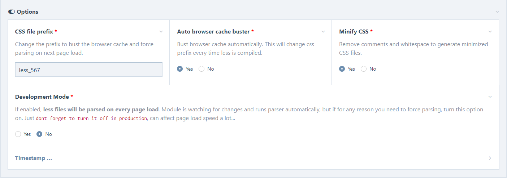

# KreativanLess
ProcessWire less parser module. Using Wikimedia fork of a PHP port of the official LESS processor https://github.com/wikimedia/less.php.    

Modules comes with few options:
- **Css File prefix**.  Change it manually, to bust the browser cache...
-	**Auto browser cache buster**. Change css prefix every time less is parsed, to make sure browser cache is busted
- **Minify CSS**. Remove comments and whitespace to generate minimized CSS files.
- **Development Mode**. If enabled, less files will be parsed on every page load. Module is watching for changes and runs parser automatically, but if for any reason you need to force parsing, turn this option on. Just dont forget to turn it off in production, can affect page load speed a lot...

NOTE: Module is not autoload, but it is watching the files passed to the method for changes and runs parser automatically.

    

### How yo use

Use `$this->getCssFile($less_files, $less_string)` method to compile your less files and get css file url.
Can parse single or multiple files in array. You can also pass additional less code as a string to the method...

```
$less_string = '@tm-primary-bg: blue;';

$less_file = 'templates/less/less_file.less';

$array = [
'templates/less/file-1.less',
'templates/less/file-2.less',
'templates/less/file-3.less',
];

Single file:        
<link rel="stylesheet" type="text/css" href="<?= $modules->get("KreativanLess")->getCssFile($less_file); ?>">    

Array of files:        
<link rel="stylesheet" type="text/css" href="<?= $modules->get("KreativanLess")->getCssFile($array); ?>  

Files + Additional less code...    
<link rel="stylesheet" type="text/css" href="<?= $modules->get("KreativanLess")->getCssFile($array, $less_string); ?>    
```

